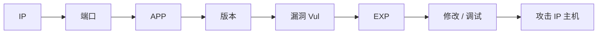

在 oscp 考试的过程中，不需要使用被动信息收集，只需要使用主动信息收集。

在 oscp 考试的过程中会主动提供 ip 信息，在实际的渗透过程中，可能需要自己发现 ip 地址。

信息收集的 7 个主要步骤
---

```mermaid
flowchart LR
    A["IP"] --> B["端口"]
    B --> C["APP"]
    C --> D["版本"]
    D --> E["漏洞 Vul"]
    E --> F["EXP"]
    F --> G["修改 / 调试"]
    G --> H["攻击 IP 主机"]
```

