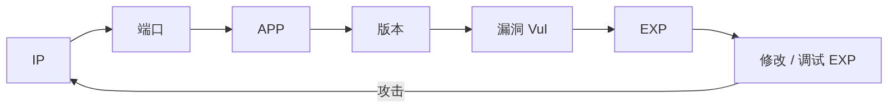

在 oscp 考试的过程中，不需要使用被动信息收集，只需要使用主动信息收集。

在 oscp 考试的过程中会主动提供 ip 信息，在实际的渗透过程中，可能需要自己发现 ip 地址。

- 信息收集的 7 个主要步骤

  - 应用识别 ---> 识别版本信息
  - 现成的 exp 可能需要进行微调、修改才能使用
  - oscp 考试的过程中会直接给出 ip 地址。

- 在实际的渗透测试过程中，可能需要通过被动信息收集获取目标 ip（可能有很多个），每个 ip 进行全端口扫描。
  - 识别出所有的 ip 地址，这就从 ip 层面把所有的 ip 发现了，这就是 ip 层面完整的攻击面。
  - 在端口层面把所有的端口扫描出来，这就是端口层面的完整攻击面。
  - 在应用层面把每个端口上跑的应用都识别出来，这是应用层面的攻击面。
  - 然后进行漏洞查找。
  - 可能可以找到 exp，也可能找不到，找不到就先放弃。漏洞挖掘是漏洞挖掘工作者，他们要去挖掘，去开发 exp。我们作为渗透测试的实操者，项目渗透的实际执行者，通常不会现场开发 exp，这个东西非常耗时。

